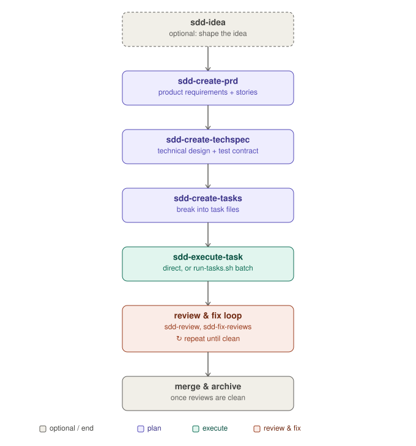

# SDD Framework

A portable spec-driven development pipeline for Claude Code (or any agent runtime with an
equivalent Markdown-skill and subagent mechanism). It carries a feature from idea to merged,
reviewed code through a chain of skills, with artifacts checked into the repo alongside the code
they describe.

The pipeline (PRD → TechSpec → Tasks with a tracked test contract → Execution → Review → Fix,
gated by mandatory verification) is plain Markdown skills plus one optional bash script — no
daemon, no extension system, no multi-runtime CLI, no external review provider — so it drops into
any repo without installing a separate binary.

## Install

Copy the skill and agent directories into your project's (or global) Claude Code config:

```bash
cp -r skills/* /path/to/your/project/.claude/skills/
cp -r agents/* /path/to/your/project/.claude/agents/
```

(`agents/` is only needed if you plan to use `sdd-idea`'s council debate. Other runtimes: copy
`skills/` into whatever directory your runtime scans for `SKILL.md` files, and `agents/` into its
subagent directory.)

`scripts/run-tasks.sh` is optional — copy it into your project if you want unattended batch
execution across a task graph:

```bash
cp scripts/run-tasks.sh /path/to/your/project/scripts/
```

It shells out to `claude -p` by default; pass `--agent-cmd "<other headless CLI>"` to use a
different runtime.

## Pipeline



```
/sdd-idea (optional)  ->  /sdd-create-prd  ->  /sdd-create-techspec  ->  /sdd-create-tasks
   ->  /sdd-execute-task (direct, or scripts/run-tasks.sh <slug>)
   ->  /sdd-review  ->  /sdd-fix-reviews  ->  (repeat review/fix until clean)  ->  merge
```

Read [`skills/sdd/SKILL.md`](skills/sdd/SKILL.md) for the full reference: pipeline diagram,
artifact directory layout, the skill table, and the optional `.docs/config.toml`.

## What's in here

- `skills/sdd*` — the 10 pipeline skills (ideation, PRD, TechSpec, task breakdown, execution,
  review, fix, verification gate, workflow memory, and the reference guide itself).
- `skills/git-rebase` — conservative conflict resolution for automated integration branches.
- `skills/impl-peer-review`, `skills/spec-peer-review` — optional independent-subagent review
  rounds for a diff or a spec, separate from the main `sdd-review` flow.
- `skills/systematic-debugging`, `skills/no-workarounds`, `skills/testing-boss`,
  `skills/refactoring-analysis`, `skills/architectural-analysis`, `skills/agent-output-audit`,
  `skills/grill-me`, `skills/writing-skills`, `skills/deslop`, `skills/handoff`,
  `skills/lesson-learned`, `skills/context7`, `skills/exa-web-search-free` — general-purpose
  engineering skills the pipeline references (e.g. `sdd-final-verify`'s optional deslop gate) or
  that are simply useful alongside it. Drop any you don't want; nothing else in the pipeline
  hard-requires them except where its own `SKILL.md` says a gate self-skips when the skill is
  absent.
- `agents/` — the six council personas `sdd-idea` debates with (`pragmatic-engineer`,
  `architect-advisor`, `security-advocate`, `product-mind`, `devils-advocate`, `the-thinker`).
- `scripts/run-tasks.sh` — optional batch dispatcher for `_tasks.md`'s dependency graph.

## What's deliberately not here

No daemon, no extension system, no multi-agent-runtime CLI, no external review-provider
integration (CodeRabbit, etc.), and no frontend/TUI-stack skills (React, shadcn, Tailwind,
TanStack, Bubbletea, ...) — those are specific to any one codebase's stack, not to the pipeline.
If your project needs stack-specific skills, add your own alongside these.

## Customizing

- `.docs/config.toml` is optional; only `[tasks].types` is read, to override the default task-type
  enum (`frontend`, `backend`, `docs`, `test`, `infra`, `refactor`, `chore`, `bugfix`).
- Add a project `CLAUDE.md`/`AGENTS.md` pointing at these skills — see `AGENTS.md` in this
  directory for a starting template.
