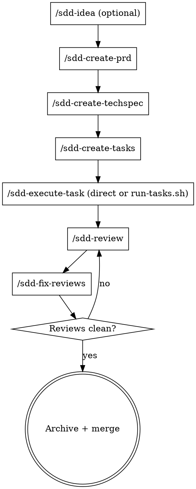

# SDD Reference Guide

Reference for this repository's spec-driven development pipeline: a set of Markdown skills for Claude Code (or any agent runtime with an equivalent skill mechanism) that carries a feature from idea to merged, reviewed code.

## What This Is

A portable, CLI-free spec-driven development pipeline. It covers ideation, requirements, technical design, task decomposition, execution, and review — with no daemon, no external control plane, and no dependency on a specific agent vendor beyond the runtime's own skill/subagent mechanism.

Key characteristics:

- **Runtime-agnostic mechanics.** Every skill assumes only: a way to install Markdown skills (`skills/<name>/SKILL.md`), an interactive question tool, and a subagent/Agent dispatch facility. No specific CLI binary is required.
- **Artifact-driven.** Planning and review artifacts live as Markdown under `.sdd/tasks/<slug>/`, versioned alongside the codebase.
- **Human-in-the-loop by design.** Every planning phase (PRD, TechSpec) gates on interactive questions before writing. Execution and remediation phases run uninterrupted once scoped, because pausing mid-batch defeats automation.

## Workflow Pipeline Overview

1. **Ideation** (optional) — `/sdd-idea` expands a raw idea into a structured, research-backed spec at `.sdd/tasks/<slug>/_idea.md`, optionally using the council agents in `agents/` for a multi-perspective debate.
2. **Requirements** — `/sdd-create-prd` creates a business-focused Product Requirements Document at `.sdd/tasks/<slug>/_prd.md` plus the user-story catalog `_user_stories.md`, with ADRs.
3. **Technical Design** — `/sdd-create-techspec` translates the PRD into a technical specification at `.sdd/tasks/<slug>/_techspec.md` plus the test contract `_tests.md`, with ADRs.
4. **Task Decomposition** — `/sdd-create-tasks` breaks down the PRD and TechSpec into robust, independently implementable task files (`task_01.md`, `task_02.md`, etc.) and a canonical task graph manifest at `_tasks.md`, assigning every `_tests.md` case to a task.
5. **Execution** — invoke `/sdd-execute-task` directly on one task file, or run `scripts/run-tasks.sh <slug>` to dispatch every pending task in `_tasks.md` dependency order (parallel within a wave, sequential across waves).
6. **Review** — `/sdd-review` performs a manual AI review of the implementation and writes review issue files under `reviews-NNN/`.
7. **Remediation** — `/sdd-fix-reviews` processes the review issue files: triages, fixes, and verifies each one.
8. **Archive** — once all reviews are clean, move the workflow directory to `.sdd/tasks/_archived/<timestamp>-<slug>/` (a plain `mv`; no tooling required) and merge.

Repeat steps 6–7 until the review is clean, then merge.



## Core Skills Summary

| Skill | Trigger | When To Use | Do Not Use For |
| --- | --- | --- | --- |
| `sdd-create-prd` | `/sdd-create-prd` | Building a Product Requirements Document | TechSpec, task breakdown, coding |
| `sdd-create-techspec` | `/sdd-create-techspec` | Translating PRD into technical design | PRD creation, task execution |
| `sdd-create-tasks` | `/sdd-create-tasks` | Decomposing PRD+TechSpec into task files | Execution, review |
| `sdd-execute-task` | direct or via `scripts/run-tasks.sh` | Executing a single PRD task | Direct use without a task file, review work |
| `sdd-review` | `/sdd-review` | Performing comprehensive code review | Fixing issues, task execution |
| `sdd-fix-reviews` | `/sdd-fix-reviews` | Remediating review issues | Producing reviews, task execution |
| `sdd-final-verify` | (used by other skills) | Enforcing verification before completion claims | Early planning, brainstorming |
| `sdd-workflow-memory` | (used by other skills) | Maintaining cross-task workflow memory | PR reviews, user preferences |
| `sdd-idea` | `/sdd-idea` | Raw feature idea needs structured exploration before a PRD | Detailed technical design |
| `sdd` | `/sdd` | Learning how this pipeline works | Executing workflow steps |

Plus a set of general-purpose engineering skills bundled alongside the pipeline (`systematic-debugging`, `no-workarounds`, `testing-boss`, `refactoring-analysis`, `architectural-analysis`, `impl-peer-review`, `spec-peer-review`, `agent-output-audit`, `grill-me`, `writing-skills`, `deslop`, `handoff`, `lesson-learned`, `context7`, `exa-web-search-free`, `git-rebase`) — see each `SKILL.md` for scope.

## Artifact Directory Structure

```
.sdd/
  config.toml                          # Optional workspace configuration
  tasks/
    <slug>/                            # One directory per workflow
      _idea.md                         # Idea spec (from sdd-idea)
      _prd.md                          # Product Requirements Document
      _user_stories.md                 # User-story catalog (companion to the PRD)
      _techspec.md                     # Technical Specification
      _tests.md                        # Test contract (companion to the TechSpec)
      _tasks.md                        # Task graph manifest
      task_01.md ... task_N.md         # Individual task files
      adrs/
        adr-001.md ... adr-NNN.md      # Architecture Decision Records
      reviews-NNN/
        issue_001.md ... issue_N.md    # Review issues with round metadata in frontmatter
      memory/
        MEMORY.md                      # Shared workflow memory
        task_01.md ... task_N.md       # Per-task memory
    _archived/
      <timestamp>-<slug>/             # Archived completed workflows (moved manually)
```

## Configuration

Workspace defaults, if you want them, live in an optional `.sdd/config.toml` read directly by the skills (no parser required — it's plain text an agent reads):

```toml
[tasks]
types = ["frontend", "backend", "docs", "test", "infra", "refactor", "chore", "bugfix"]
```

`sdd-create-tasks` reads `[tasks].types` when present and falls back to the built-in defaults otherwise. There is no other required configuration — everything else is a per-invocation argument to the relevant skill.

## Council Agents (used by `sdd-idea`)

Six standalone reviewer personas live in `agents/`, installable as subagents in the runtime (e.g. `.claude/agents/` for Claude Code):

| Agent | Perspective |
| --- | --- |
| `pragmatic-engineer` | Execution-focused, delivery speed, maintenance burden |
| `architect-advisor` | Long-term system coherence, boundaries, coupling |
| `security-advocate` | Attack vectors, compliance, data protection |
| `product-mind` | User impact, business value, opportunity cost |
| `devils-advocate` | Challenges assumptions, surfaces risks, stress-tests |
| `the-thinker` | Cross-domain patterns, structural reframing |

`sdd-idea` uses these agents in a council debate to challenge feature scope and surface risks before a PRD is written.

## Common Patterns

- Follow the pipeline in order: idea (optional) -> PRD -> TechSpec -> Tasks -> Execution -> Review -> Fix.
- Configure `.sdd/config.toml` only if the built-in task-type defaults don't fit the project.
- Run `scripts/run-tasks.sh <slug>` for unattended batch execution across a task graph; invoke `sdd-execute-task` directly for a single task.
- Archive a workflow (`mv .sdd/tasks/<slug> .sdd/tasks/_archived/<timestamp>-<slug>`) once all reviews are clean, to keep the tasks directory focused.

## Anti-Patterns

- **Skipping pipeline stages.** Executing tasks without a PRD and task files produces poor results.
- **Invoking `sdd-execute-task` on a task whose dependencies (per `_tasks.md`) haven't completed.** Respect the graph.
- **Mixing workflow skills out of order.** Running `sdd-create-tasks` without a PRD and TechSpec leads to shallow task decomposition.
- **Editing task file frontmatter by hand without checking `references/task-context-schema.md`'s Manual Validation checklist afterward.**
- **Skipping verification.** Always use `sdd-final-verify` before claiming task completion or creating commits.
